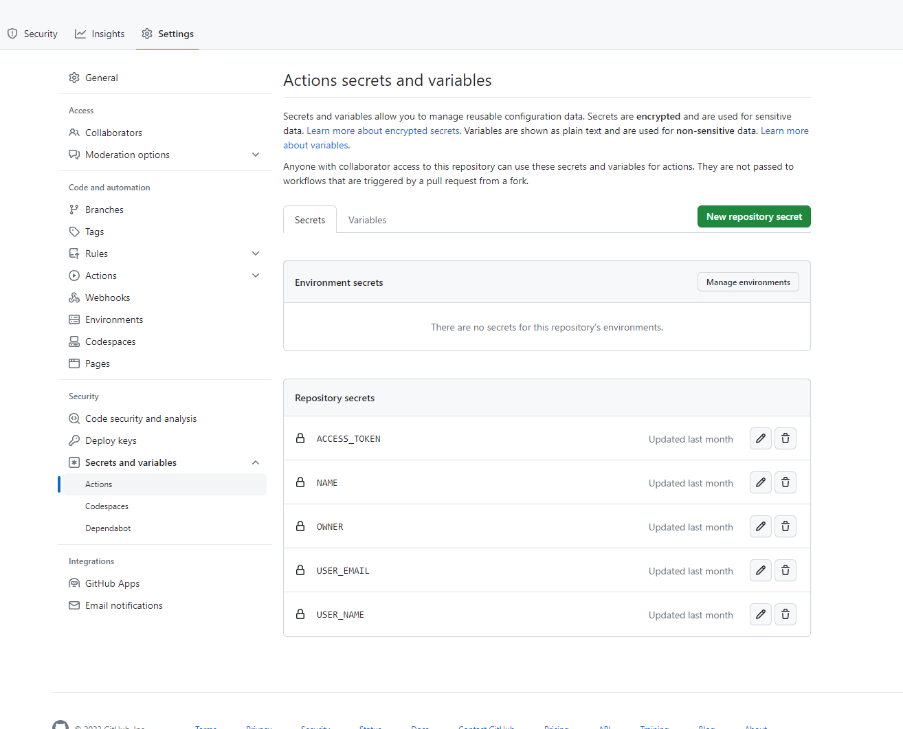

# Developer Journal

<!-- Structure should be https://github.com/{owner}/{repoName}/ -->

[github-learning]: https://github.com/hanfamilym1/developer-journal-template/pulls?q=is%3Apr+is%3Aclosed+label%3Alearning
[github-language]: https://github.com/hanfamilym1/developer-journal-template/pulls?q=is%3Apr+is%3Aclosed+label%3Alanguage
[github-snippet]: https://github.com/hanfamilym1/developer-journal-template/pulls?q=is%3Apr+is%3Aclosed+label%3Asnippet
[github-tool]: https://github.com/hanfamilym1/developer-journal-template/pulls?q=is%3Apr+is%3Aclosed+label%3Atool
[github-wins]: https://github.com/hanfamilym1/developer-journal-template/pulls?q=is%3Apr+is%3Aclosed+label%3Awins
[github-brag]: https://github.com/hanfamilym1/developer-journal-template/pulls?q=is%3Apr+is%3Aclosed+label%3Abrag

[][github-learning]
[][github-snippet]
[][github-tool]
[][github-language]
[][github-wins]
[][github-brag]

Thank you for your interest in utilizing this repository! This guide will walk you through the process of forking the repo, creating a Markdown file for your learning entry, and contributing it back to the repository while following the required guidelines.

## Step 1: Fork the Repository

To get started, you need to fork the original repository. Follow these steps:

1. Visit the original repository at [developer-journal-template](https://github.com/hanfamilym1/developer-journal-template).
2. Click the "Fork" button at the top-right corner of the page.
3. This will create a copy of the repository in your GitHub account.

## Step 2: Setting up the github repo

1. In settings, you'll need to add:

- ACCESS_TOKEN # This is your github access token that you can find via this [github doc](https://docs.github.com/en/enterprise-server@3.6/authentication/keeping-your-account-and-data-secure/managing-your-personal-access-tokens)
- NAME # This is the repository name. In this case, the example is: developer-journal-template
- OWNER # This is your github name. In this case, hanfamilym1
- USER_EMAIL # Your email that is associated with your github
- USER_NAME # This is your github name.



This will create all the actions to work correctly for the next steps.

## Step 3: Create a New Markdown File

Now that you have your own copy of the repository, it's time to create a new Markdown file for your learning entry.

Run

```
npm run generate insert_title
```

insert_title = whatever will help you remember the initial title that you'd like to have as a keyword

This will generate the new markdown file in the correct space.

## Step 4: Document Your Learning

In the newly created Markdown file, document your learning experience using the following format:

```markdown
# Learning Entry - Date

## Type of Learning: [Snippet / Learning / Tool / Language / Win / Bragging]

### What I've Learned:

[Write here what you've learned during your study, experiment, or exploration. Be as detailed and informative as possible.]
```

Replace \`[Snippet / Learning / Tool / Language]\` with the specific type of learning you had. For example, if you learned a new programming language, you can replace it with "Language." If it's a useful code snippet you discovered, use "Snippet," and so on.

## Step 5: Create a Different Branch

Before pushing your changes to your forked repository, create a new branch with a descriptive name that indicates the type of learning and what it is about. Follow this naming convention:

```
{type of learning}/{what it is}
```

For example, if you learned a new Python library, your branch name could be \`learning/python-library\`. This naming convention will help keep the repository organized and make it easier for others to find relevant entries.

## Step 6: Push and Create a Pull Request

Once you have committed your changes to the new branch, push it to your forked repository. Then, navigate to the original repository on GitHub and create a new Pull Request (PR) with the following steps:

1. Click on the "Pull Requests" tab in the original repository.
2. Click the "New Pull Request" button.
3. Select your forked repository and the branch you created from the dropdowns.
4. Review the changes and create the pull request.

## Step 7: Add Specific Label

Finally, to help with the repository's organization, add a specific label to your Pull Request that corresponds to the type of learning you documented in your entry. For example, you can use labels like "Snippet," "Learning," "Tool," or "Language" based on your entry type.

That's it! You have successfully utilized the repository by forking, creating a new learning entry, and contributing it back following the required guidelines. Thank you for your contribution!
